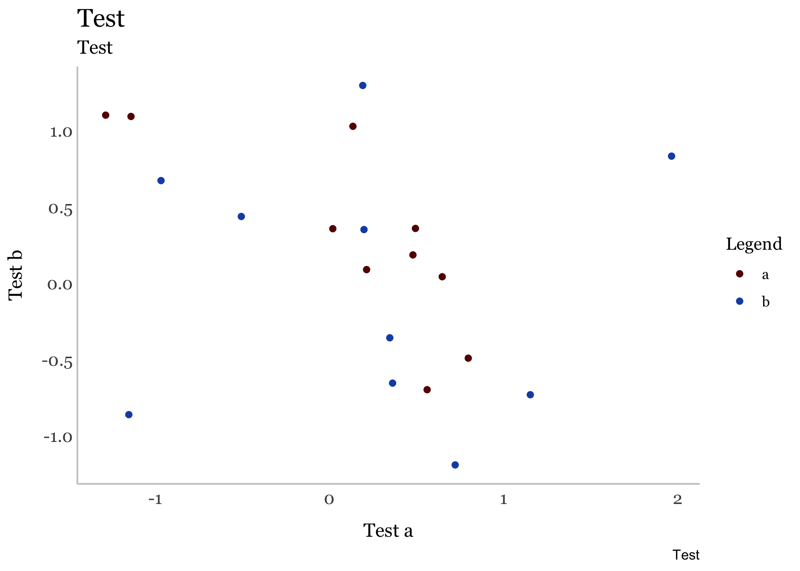

<!-- README.md is generated from README.Rmd. Please edit that file -->
councildown
===========

The `councildown` package implements style guide compliant defaults for R Markdown documents, `ggplot2` plots, and `leaflet` maps.

Installation
------------

You can install the released version of councildown from GitHub

``` r
remotes::install_packages("newyorkcitycouncil/councildown")
```

Example
-------

### ggplot2

On load, the `theme_set()` is called, setting `theme_nycc()` as the default `ggplot2` theme. Additionally, common `scale_*` functions are overwritten with `scale_fill_nycc()` and `scale_color_nycc()`.

``` r
tibble(x = rnorm(100), 
       y = rnorm(100), 
       z = sample(c("a", "b"), 100, replace = TRUE)) %>% 
  ggplot(aes(x, y, color = z)) +
  geom_point() +
  facet_wrap(~z) + 
  labs(title = "Title",
       subtitle = "Subtitle",
       caption = "Caption")
```



### leaflet

The function `addCouncilStyle()` adds default map tiles and City Council district outlines and labels to `leaflet` maps. Use this instead of `addTiles()`.

``` r
leaflet() %>% 
  addCouncilStyle()
```


### R Markdown

The package includes an R Markdown template for writing Council reports. After installing the package, create a new report by choosing New &gt; R Markdown &gt; From Template &gt; City Council Report in RStudio.
