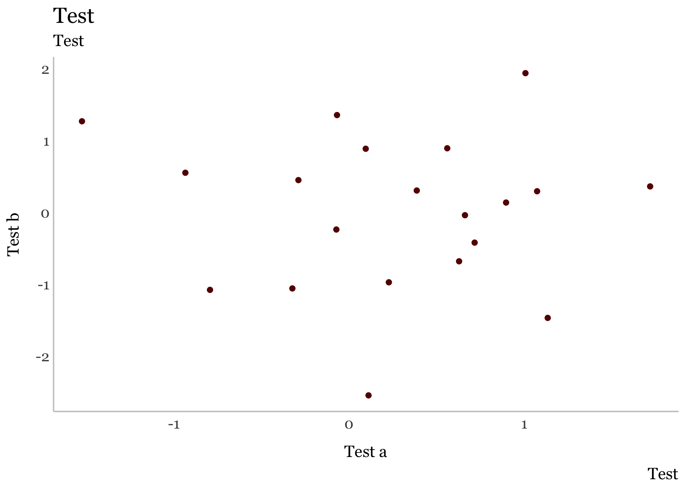

<!-- README.md is generated from README.Rmd. Please edit that file -->

# councildown

The `councildown` package implements style guide compliant defaults for
R Markdown documents, `ggplot2` plots, and `leaflet` maps.

## Installation

You can install the released version of `councildown` from GitHub

``` r
remotes::install_github("newyorkcitycouncil/councildown")
```

## Example

Note that the order of loading the libraries is important. Make sure to
load `councildown` last.

``` r
library(tidyverse)
library(councildown)
```

### ggplot2

On load, common `ggplot2` scale\_\* functions are overwritten with
`scale_fill_nycc()` and `scale_color_nycc()`.

There are 6 color palettes available for `scale_fill_nycc()` and
`scale_color_nycc()`. Check the documentation for full default
parameters. For brand guidelines, see:
<https://newyorkcitycouncil.github.io/nycc-brand-guidelines/>.

`palette = "main"` for use of primary Council colors. Default for
`scale_color_nycc()`.  
`palette = "mixed"` for secondary Council colors. Default for
`scale_fill_nycc()`.  
`palette = "bw"` for grey scale.  
`palette = "warm"` for a warm palette.  
`palette = "cool"` for a cool palette.  
`palette = "diverging"` for a diverging palette.

``` r
data.frame(x = rnorm(20), y = rnorm(20), z = c("a", "b")) %>%
  ggplot(aes(x, y, color = z)) +
 geom_point() +
 labs(title = "Test",
      subtitle = "Test",
      caption = "Test",
      color = "Legend",
      x = "Test a",
      y = "Test b") +
 theme_nycc() +
 scale_color_nycc()
```


Additionally, `theme_nycc()` has an argument `facet` for changing the
theme to better fit faceted plots.

``` r
data.frame(x = rnorm(20), y = rnorm(20), z = c("a", "b")) %>%
  ggplot(aes(x, y, color = z)) +
 geom_point() +
 labs(title = "Test",
      subtitle = "Test",
      caption = "Test",
      color = "Legend",
      x = "Test a",
      y = "Test b") +
 facet_wrap(~z) +
 theme_nycc(facet=TRUE) +
 scale_color_nycc()
```


At this time, the color palettes do not work if you are only using one
variable/color. You can manually use NYCC blue with `"#2F56A6"`.

### leaflet

The function `addCouncilStyle()` sets the default view, zoom, and
background. There is an additional option for `add_dists` to add map
tiles and City Council district outlines and labels to `leaflet` maps.

``` r
library(leaflet)
leaflet() %>% 
  addCouncilStyle(add_dists = TRUE)
```



Additionally, use `mapshot` to save leaflet maps as a static png image.
`mapshot()` overwrites `mapview::mapshot()` to force map saves with
standardized width, height, and zoom. Use `mapview::mapshot` if you want
the original `mapshot` function.

``` r
map <- leaflet() %>% 
  addCouncilStyle(add_dists = TRUE)
mapshot(map, file = "map.png")
```

### R Markdown

The package includes an R Markdown template for writing Council reports.
After installing the package, create a new report by choosing New \> R
Markdown \> From Template \> City Council Report in RStudio. \[In
Progress\]
