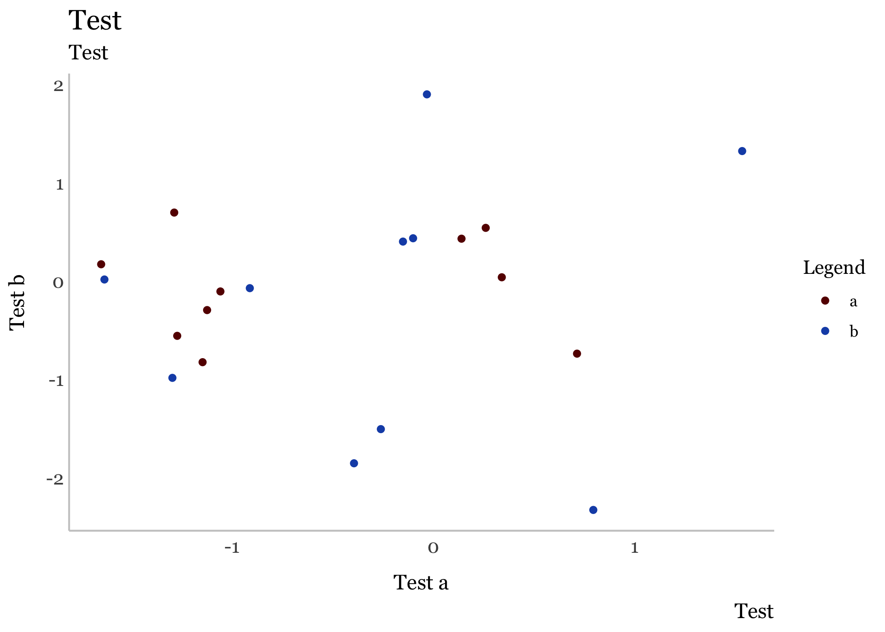

<!-- README.md is generated from README.Rmd. Please edit that file -->

# councildown

The `councildown` package implements style guide compliant defaults for
R Markdown documents, `ggplot2` plots, and `leaflet` maps.

## Installation

You can install the released version of councildown from GitHub

``` r
remotes::install_packages("newyorkcitycouncil/councildown")
```

## Example

### ggplot2

On load, the `theme_set()` is called, setting `theme_nycc()` as the
default `ggplot2` theme. Additionally, common `scale_*` functions are
overwritten with `scale_fill_nycc()` and `scale_color_nycc()`.

``` r
data.frame(x = rnorm(20), y = rnorm(20), z = c("a", "b")) %>%
  ggplot(aes(x, y, color = z)) +
 geom_point() +
 labs(title = "Test",
      subtitle = "Test",
      caption = "Test",
      color = "Legend",
      x = "Test a",
      y = "Test b") +
 theme_nycc() +
 scale_color_nycc()
```


Additionally, `theme_nycc()` has an argument `facet` for changing the
theme to better fit faceted plots.

``` r
data.frame(x = rnorm(20), y = rnorm(20), z = c("a", "b")) %>%
  ggplot(aes(x, y, color = z)) +
 geom_point() +
 labs(title = "Test",
      subtitle = "Test",
      caption = "Test",
      color = "Legend",
      x = "Test a",
      y = "Test b") +
 facet_wrap(~z) +
 theme_nycc(facet=TRUE) +
 scale_color_nycc()
```



### leaflet

The function `addCouncilStyle()` sets the default view, zoom, and
background. There is an additional option for `add_dists` to add map
tiles and City Council district outlines and labels to `leaflet` maps.

``` r
leaflet() %>% 
  addCouncilStyle(add_dists = TRUE)
```


### R Markdown

The package includes an R Markdown template for writing Council reports.
After installing the package, create a new report by choosing New \> R
Markdown \> From Template \> City Council Report in RStudio.
