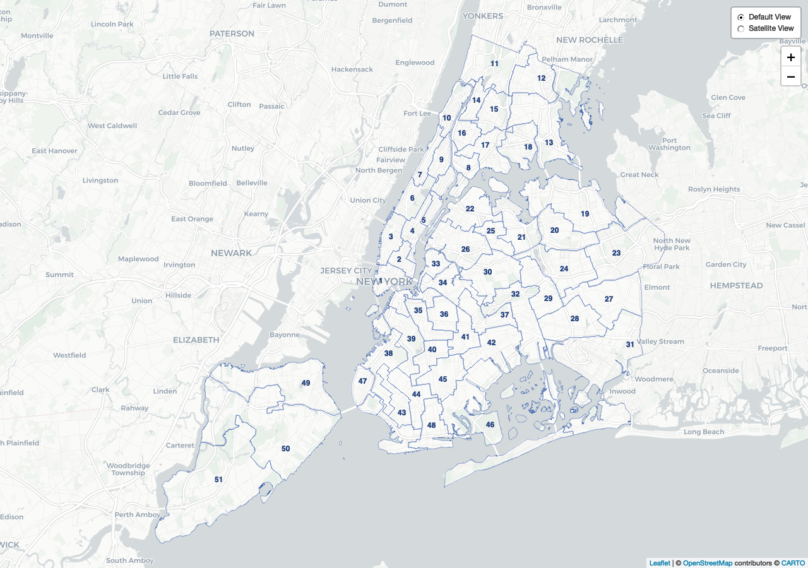

# Overview

The `councildown` package implements style guide compliant defaults for
R Markdown documents, `ggplot2` plots, and `leaflet` maps.

## Installation

You can install the released version of `councildown` from GitHub

``` r
remotes::install_github("newyorkcitycouncil/councildown")
```

## Load Package

Note that the order of loading the libraries is important. Make sure to
load `councildown` last.

``` r
library(tidyverse)
# load last
library(councildown)
```

## Vignette

For a demo of the functions available, see `vignettes/councilverse.Rmd`
in the `councilverse` package.

## Quick Start

First load the `councildown` package as above.

### ggplot2

On load, common `ggplot2` scale\_\* functions are overwritten with
[`scale_fill_nycc()`](https://newyorkcitycouncil.github.io/councildown/reference/scale_fill_nycc.md)
and
[`scale_color_nycc()`](https://newyorkcitycouncil.github.io/councildown/reference/scale_fill_nycc.md).

There are 6 color palettes available for
[`scale_fill_nycc()`](https://newyorkcitycouncil.github.io/councildown/reference/scale_fill_nycc.md)
and
[`scale_color_nycc()`](https://newyorkcitycouncil.github.io/councildown/reference/scale_fill_nycc.md).
Check the documentation for full default parameters. For brand
guidelines, see:
<https://newyorkcitycouncil.github.io/nycc-brand-guidelines/>.

`palette = "main"` for use of primary Council colors. Default for
[`scale_color_nycc()`](https://newyorkcitycouncil.github.io/councildown/reference/scale_fill_nycc.md).  
`palette = "mixed"` for secondary Council colors. Default for
[`scale_fill_nycc()`](https://newyorkcitycouncil.github.io/councildown/reference/scale_fill_nycc.md).  
`palette = "bw"` for grey scale.  
`palette = "warm"` for a warm palette.  
`palette = "cool"` for a cool palette.  
`palette = "diverging"` for a diverging palette.

If `palette = "single"` then the color will be the first color of
`"main"`.  
If `palette = "double"`, then the color will be the first and second
color of `"main"`.

``` r
data.frame(x = rnorm(20), y = rnorm(20), z = c("a", "b")) %>%
  ggplot(aes(x, y, color = z)) +
 geom_point() +
 labs(title = "Test",
      subtitle = "Test",
      caption = "Test",
      color = "Legend",
      x = "Test a",
      y = "Test b") +
  scale_color_nycc() +
  theme_nycc()
```


Additionally,
[`theme_nycc()`](https://newyorkcitycouncil.github.io/councildown/reference/theme_nycc.md)
has an argument `facet` for changing the theme to better fit faceted
plots.

``` r
data.frame(x = rnorm(20), y = rnorm(20), z = c("a", "b")) %>%
  ggplot(aes(x, y, color = z)) +
 geom_point() +
 labs(title = "Test",
      subtitle = "Test",
      caption = "Test",
      color = "Legend",
      x = "Test a",
      y = "Test b") +
  facet_wrap(~z) +
  scale_color_nycc() +
  theme_nycc(facet=TRUE)
```

If you are only using one variable/color, you can add the `"single"`
palette using `pal_nycc`. Use the `"double"` palette for two
variables/colors.

``` r
data.frame(x = rnorm(20), y = rnorm(20)) %>%
  ggplot(aes(x, y)) +
 geom_point(color = pal_nycc("single")) +
 labs(title = "Test",
      subtitle = "Test",
      caption = "Test",
      color = "Legend",
      x = "Test a",
      y = "Test b") +
  theme_nycc()
```

### leaflet

The function
[`addCouncilStyle()`](https://newyorkcitycouncil.github.io/councildown/reference/addCouncilStyle.md)
sets the default view, zoom, and background. There is an additional
option for `add_dists` to add map tiles and City Council district
outlines and labels to `leaflet` maps. The `dist_year` option allows for
`"2023"` or `"2013"` Council District lines.

``` r
library(leaflet)
leaflet() %>% 
  addCouncilStyle(add_dists = T, dist_year = "2023")
```


You may also use the add_council_basemaps function to directly add one
or more of six different background maps to your leaflet map (1 = Dark,
2 = Light, 3 = Streets, 4 = Physical, 5 = Satellite, 6 = Basic).

``` r
library(leaflet)
leaflet() %>%
  addCouncilStyle(add_dists = T, dist_year = "2023") %>%
    add_council_basemaps(selection = c(1, 5),
                       custom_names = c("Default View", "Satellite View"),
                       control_position = "topright",
                       control_collapsed = FALSE)
```



Additionally, use `mapshot` to save leaflet maps as a static png image.
[`mapshot()`](https://newyorkcitycouncil.github.io/councildown/reference/mapshot.md)
overwrites
[`mapview::mapshot()`](https://r-spatial.github.io/mapview/reference/mapshot.html)
to force map saves with standardized width, height, and zoom. Use
[`mapview::mapshot`](https://r-spatial.github.io/mapview/reference/mapshot.html)
if you want the original `mapshot` function.

``` r
map <- leaflet() %>% 
  addCouncilStyle(add_dists = T, dist_year = "2023")
mapshot(map, file = "map.png")
```

### R Markdown

The package includes an R Markdown template for writing Council reports.
After installing the package, create a new report by choosing New \> R
Markdown \> From Template \> City Council Report in RStudio. \[In
Progress\]
